<!-- .slide: class="center" -->

# Switch 2. La movida

Estado del arte de la Nintendo Switch 2.

---

# Disclaimer

<!-- .slide: class="center disclaimer" -->

Esta charla únicamente tiene **fines educativos**.

El autor en ningún momento promueve o alienta a la piratería.

---

# YO

    

        
    

    

          
        Ángel Kemp
          
        Evaluador en Jtsec
    

Note:
Pero que estado del arte ni mierdas, si todo el mundo sabe que la hackearon a los dias de salir.

---

## Pero si ya se ha hackeado, pelele

    <video controls width="100%">
      <source src="videos/retroid_userland_rop.mp4" type="video/mp4">
    </video>

---

# Motivación

¿Qué significa realmente "hackear" una consola?

Sobre todo, una consola moderna

Note:
Quería entender a fondo los pasos necesarios que hacen falta para que una
consola pueda ser "hackeada", esto, es poder ejecutar cualquier tipo de código
arbitrario (sin firmar) en la consola.

--

## Definición

Poder ejecutar tu propio código usando todo el potencial de la consola que te pertenece.

Note:
te has comprado una consola y quieres desarrollar software para ella.

---

# Índice

- Entrypoints típicos
- Historia de la Switch 1
    - Primer Exploit
    - Exploit más relevante
- Actualidad
- Switch 2

---

# Entrypoints

**Chipeacion**

Note:
Chipeacion: directamente bypasseas las medidas de seguridad. Muy enfocado en fault injection.
Saltarse instrucciones rayando la placa

--

## PS2

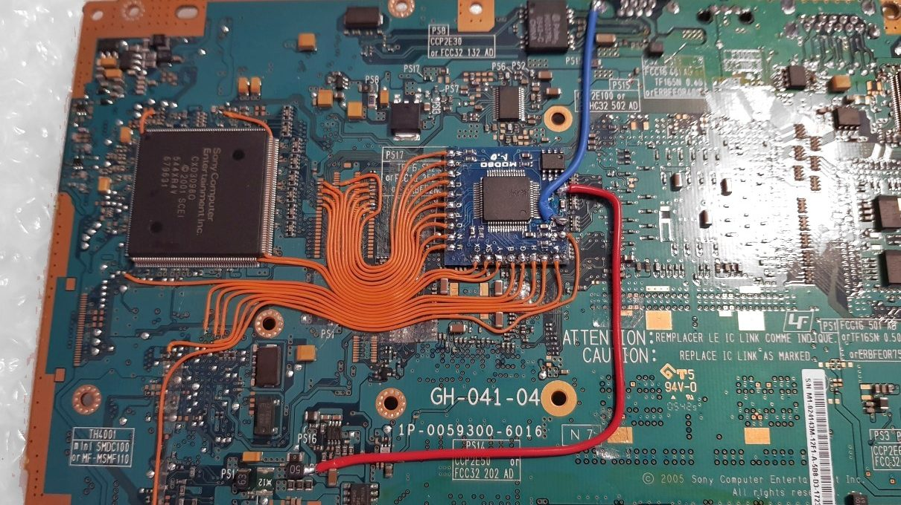

Note:
Enfocado directamente en la piratería.
Que vas a hacer un check de firma, nonono

---

# Entrypoints

Chipeacion 
**Archivos de guardado**

Note:
Archivos de guardado: Si un juego tiene un parser del archivo de guardado vulnerable,
se puede hacer buffer overflow y ganar ejecución de código.

--

--

Note:
Poniendo el nombre in-game si que verificaba tamaño, desde el save no.
No había ASLR, como ya corría en un juego firmado, confiaba en el código, en resumen, poca mitigación moderna.

---

# Entrypoints

Chipeacion 
Archivos de guardado 
**Navegadores**

--

## Webkit

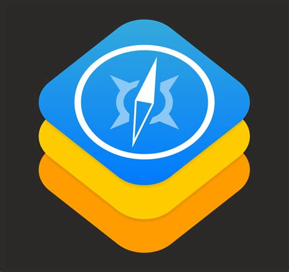

Note:
Navegadores: sobre todo webkit, plagado de vulnerabilidades. Ejecutar javascript es una movida.
Motor de navegador hecho por Apple, open-source, modular, licencia permisiva.

--

## Ejemplos

Nintendo Wii

Nintendo Wii <b>U</b>

Nintendo 3DS

PS Vita

PS3

PS4

PS5

...

---

# Historia de la Switch 1

Note:
Es muy importante conocer como funciona la Switch 1 y sus debilidades/fortalezas
para conocer bien como afecta eso a la Switch 2. Son primas hermanas

---

## Que hay dentro

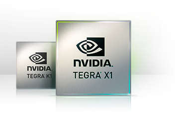

Note:
Que se os quede en la cabeza este chip, es el que usa la nintendo Switch y será importante más adelante.
Por ahora sabed que existen placas de desarrollo y documentación pública del chip, quitando aspectos de seguridad.

--

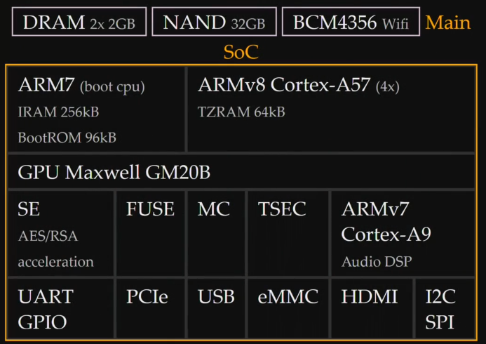

---

## SO

    

        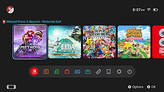
    

    

        
Nombre en clave "Horizon"

        
SO propietario

        
Arquitectura microkernel

        
Evolución de la 3DS

    

---

## Modelo de seguridad

<!-- .slide: class="security-slide" -->

  

    TrustZone
    crypto
  

  

    Kernel
    process isolation, IOMMU
  

  

    fs
    ncm
    sm
    pm
    ldr
    spl
  

  

    Microservices
    least privilege
  

  

    Game/Application
    untrusted
  

Note:
Cada fila tiene acceso a llamadas al sistema limitadas.

---

## Primer entrypoint

Teniendo en cuenta que la switch, en sus primeras versiones no tenía la aplicación de navegador, ¿cuál creeis que fue su primer entrypoint?

Efectivamente, <b>el navegador</b>

---

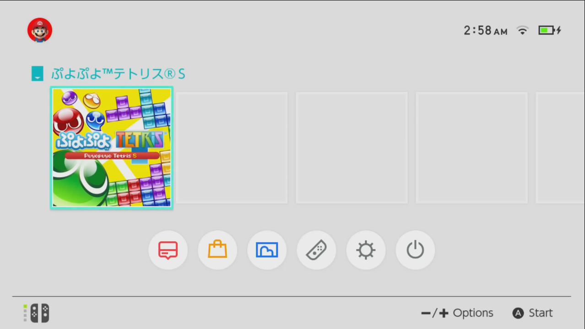

---

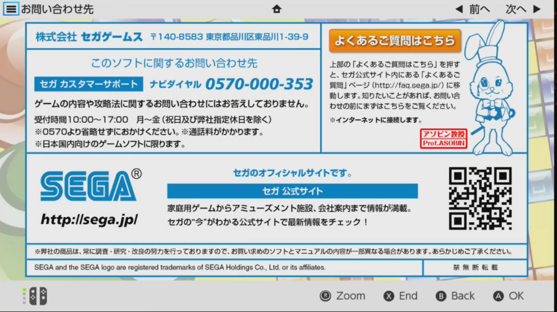

Note:
puedes clickar en el enlace de SEGA.

--

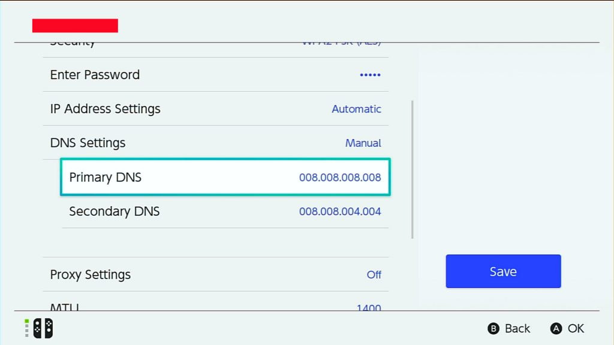

Note:
Si lo juntas con las opciones de proxy de la propia consola, ya estaría, controlas la página.

--

### CVE-2016-4657

Note:
Hay un video mu weno de live overflow que explica técnicamente la base del exploit.

---

En la versión 2.0 del firmware introdujeron soporte para los portales captivos.

Ejemplo:

Te conectas al wifi público del aeropuerto y te pide pelas</b>

---

<!-- .slide: class="security-slide" -->

  

    TrustZone
    crypto
  

  

    Kernel
    process isolation, IOMMU
  

  

    fs
    ncm
    sm
    pm
    ldr
    spl
  

  

    Microservices
    least privilege
  

  

    Game/Application
    untrusted
  

Note:
Todavía no se puede dumpear nada de los microservicios.

---

Mediante black-box testing, se pudo detectar un array out-of-bound read.

Si especificabas índices negativos, te dumpeaba el código (.text)

Note:
quedaos con esta idea de dumpear código.

---

<!-- .slide: class="security-slide" -->

  

    TrustZone
    crypto
  

  

    Kernel
    process isolation, IOMMU
  

  

    fs
    ncm
    sm
    pm
    ldr
    spl
  

  

    Microservices
    least privilege
  

  

    Game/Application
    untrusted
  

Note:
Focus ahora en SM, es el portero que dicta si te puedes comunicar o no con procesos.

---

### Protocolo IPC

Note:
Yo como proceso tengo que pedirle permiso al kernel para comunicarme con otro proceso.

--

### SM

    

        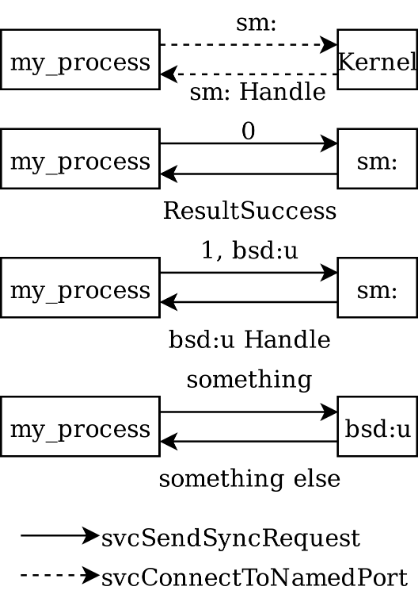
    

    

        
Proceso pide handle de sm

        
Inicialización (0)

        
Proceso pide handle del otro proceso

        
Comunicación con el otro proceso

    

--

Pero... 
¿y si no dices de inicializar?

El campo PID de SM se queda a 0.

<b>Puedes comunicarte con cualquier proceso</b>

---

<!-- .slide: class="security-slide" -->

  

    TrustZone
    crypto
  

  

    Kernel
    process isolation, IOMMU
  

  

    fs
    ncm
    sm
    pm
    ldr
    spl
  

  

    Microservices
    least privilege
  

  

    Game/Application
    untrusted
  

Note:
Puedes comunicarte con los procesos, pero "a ciegas".
Hay que encontrar una manera de dumpear código.

No me queda muy claro, pero sacaron como se lanzaba un proceso y la función que se encargaba de montar el los archivos del sistema

---

### fsp-ldr

Este servicio, presente dentro de FS, permite, entre otras cosas, dumpear todos los módulos de código.

Resulta que solo se puede tener una sesión activa con este servicio

Si crasheas el servicio LDR, <b>se libera la sesión...</b>

Resulta que se puede crashear de muchas maneras...

Ejemplo: ldr:ro cmd 0

<b>Profit</b>

---

<!-- .slide: class="security-slide" -->

  

    TrustZone
    crypto
  

  

    Kernel
    process isolation, IOMMU
  

  

    fs
    ncm
    sm
    pm
    ldr
    spl
  

  

    Microservices
    least privilege
  

  

    Game/Application
    untrusted
  

Note:
Ojos al kernel, ¿como dumpeas su código?

---

### Kernel

Muy complicado sacar primitivas de lectura mediante black-box.

Sobre todo mediante software

¿Por qué no se prueba desde hardware?

Voltage glitching

<b>Profit</b>

Note:
Como dije al principio, el procesador que usa la Switch está documentado, su proceso de arranque también.
La idea es glitchear, justo después de que se ejecute el bootROM, para poder sobreescribir la clave con la que va firmada el código del bootloader

--

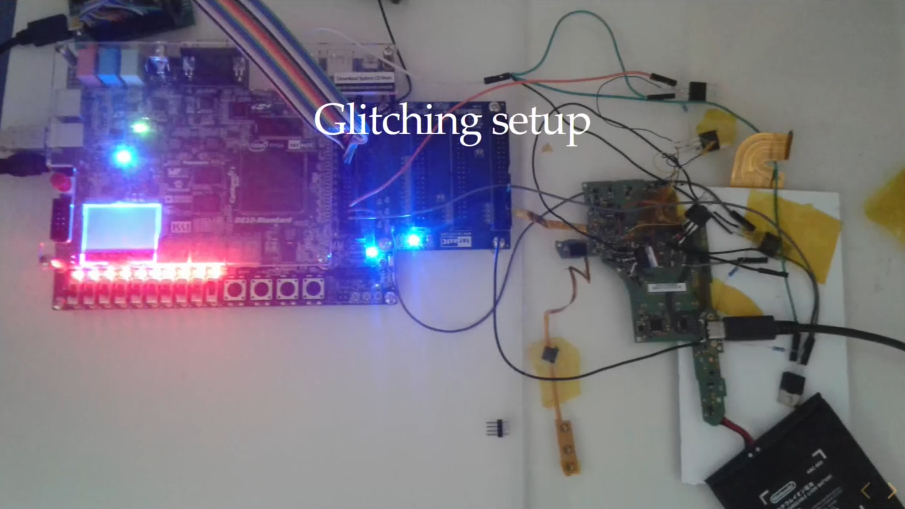

Note:
Recuerdo que la idea de esto es sacar el código del kernel para analizarlo y explotarlo.

--

Accidentalmente, mapearon el ejecutable del kernel en userspace lol.

Note:
Aunque no se permitía leer, al no implementar kASLR, se podían ejecutar funciones del kernel. "ASLR Bypass"

--

Existía una última protección: SMMU (IOMMU)

Era bastante bypasseable

Note:
Entrada y salida mapeada a memoria, el kernel se encargaba de mantener una tabla que restringía el acceso a memoria de los dispositivos.

---

<!-- .slide: class="security-slide" -->

  

    TrustZone
    crypto
  

  

    Kernel
    process isolation, IOMMU
  

  

    fs
    ncm
    sm
    pm
    ldr
    spl
  

  

    Microservices
    least privilege
  

  

    Game/Application
    untrusted
  

Note:
Faltaría por explicar como se cargaron la TrustZone, pero realmente una vez tienes el kernel comprometido ya no hace falta más.
Se abusaba de la funcionalidad de "deep sleep". Parámetros críticos de crypto se guardaban en la RAM. Se lo pides al kernel y ya.

---

## Exploit más relevante

### Fusée-gelée

---

Note:
ESPERO QUE OS ACORDÉIS DEL CHIP

--

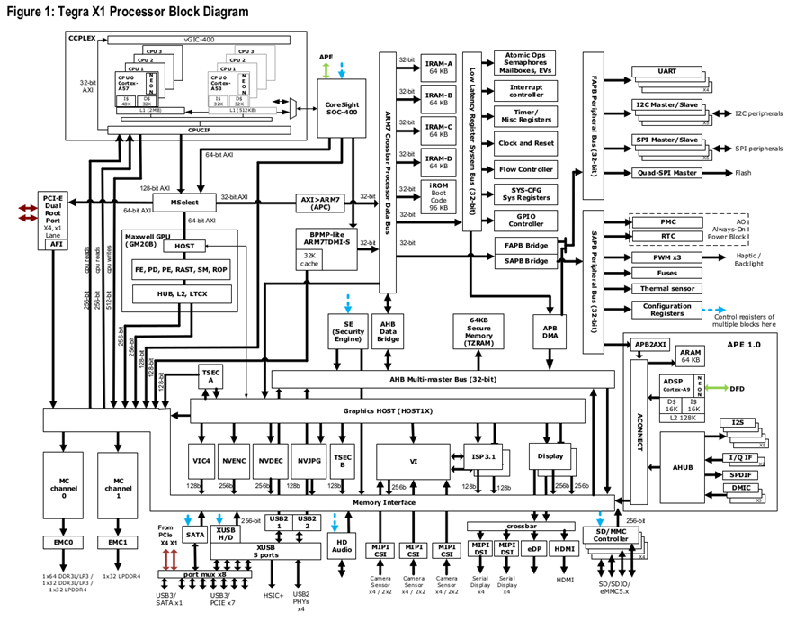

--

    

        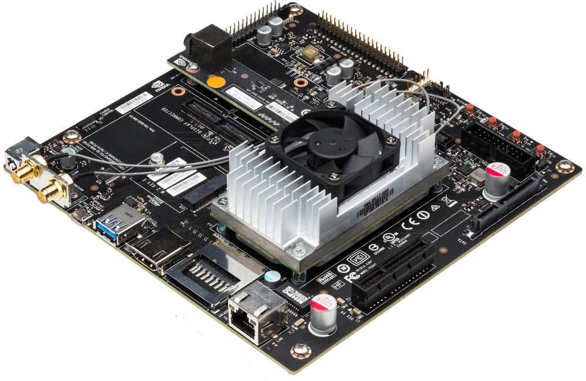
    

    

        
Placa de desarrollo

        
Cualquiera puede comprarla

        
Documento técnico muy extenso, público

        
Casualmente no hay nada relacionado con la seguridad en esa documentación

    

--

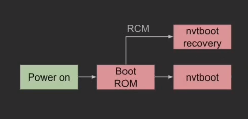

--

A pesar que había placas de desarrollo y mucha documentación sobre el procesador, la chicha estaba "oculta".

No se podía obtener el código de la secuencia de boot

Estaba protegido contra lectura 

Voltage glitching

Note:
Usando la documentación pública, se pudo discernir que se escribía un byte que luego hacía que se protegiese la ROM
Glitcheando la instrucción que escribía ese byte, no se protegía la ROM y se podía leer.

---

### Vale pero ¿y que?

--

--

La funcionalidad de recovery permite ejecutar código <b>firmado</b>.

Note:
Útil en la fábrica o cuando se brickea una Switch.

--

Realmente habla USB.

Había un buffer overflow en como gestionaba el control de USB

<b>Profit</b>

Note:
Por como implementaban los dispositivos USB, podías especificar código, y antes
que revisase si estaba firmado o no, hacer el overflow y que la dirección de retorno
apunte al payload.

---

El bug no se reportaría a Nintendo, sino a Nvidia directamente.

<b>Hasta que no salieron nuevas Switches con una nueva remesa de procesadores parcheados, no se solucionó</b>

---

### Entrando en modo recovery

Tres posibilidades:

Ejecución de código en el kernel

Quitas la placa eMMC

Presionas una combinación mágica mientras enciendes

"Volumen Arriba" + "Home"

Note:
No existe el botón HOME, existe un pin GPIO, localizado en el joycon derecho

--

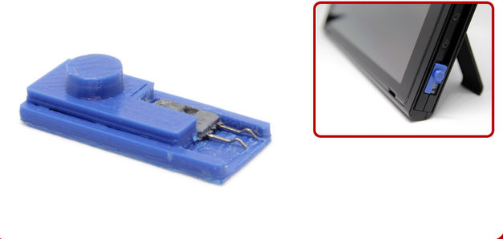

---

# Actualidad

A dia de hoy, el firmware de la Switch, a menos que sea con modchip, no se puede hacer nada.
Se parchea todo lo que va saliendo.

    

        
- ASLR

        
- kASLR

        
- kASLR

    

    

        
- PASLR

        
- Software PAC

        
- RelRO

    

Note:
- PAC: Pointer Authentication, los punteros van firmados
- RelRO: No permite sobreescribir punteros del "got".

---

# SWITCH 2

---

<!-- .slide: class="security-slide" -->

  

    TrustZone
    crypto
  

  

    Kernel
    process isolation, IOMMU
  

  

    "Kernel"Services
  

  

    Microservices
    least privilege
  

  

    Game/Application
    untrusted
  

Note:
Es lo mismo que la SW1, ¿no?

---

## eXecute Only Memory (XOM) (--x)

Las secciones .text no se pueden leer, solo ejecutar x.x

Funciona a nivel de procesador

Note:
Como proceso, no necesitas leer el código, solo que puedas saltar a él para que el procesador se encargue de ejecutarlo.
En la SW1 se soporta a partir de cierta versión del firmware, pero no se usa.

--

Los últimos cartuchos que están saliendo implementan esto.

En el firmware que traía la SW2 de salida, los sysmodules también

---

## PAC a nivel de hardware

Las direcciones de retorno del stack están firmadas.

Funciona a nivel de procesador

Note:
En la SW1, funcionaba a nivel de software

---

## Procesador

Se sabe cual es el modelo (Tegra T239).

Única y exclusivamente lo usa Nintendo para la Switch 2

Ni documentación ni devkit ni pollas

Soporta encriptación de memoria

Note:
Aunque se sniffe el bus de la memoria, no se vería nada.

---

## ¿Qué ha pasado de momento?

El navegador...

Juegos de switch 1 con saves "maliciosos"

Bastante "sandboxeados", con pocos privilegios interesantes

El "sysmodule" "ldn" ha sido "comprometido"

<b>Intentos de glitch electromagnéticos en el bus de la DRAM</b>

Note:
De lo del sysmodule se sacó que tienen XOM
De los intentos de glitch se sacó que la memoria estaba encriptada, los esfuerzos
de investigación se están centrando aquí.

---

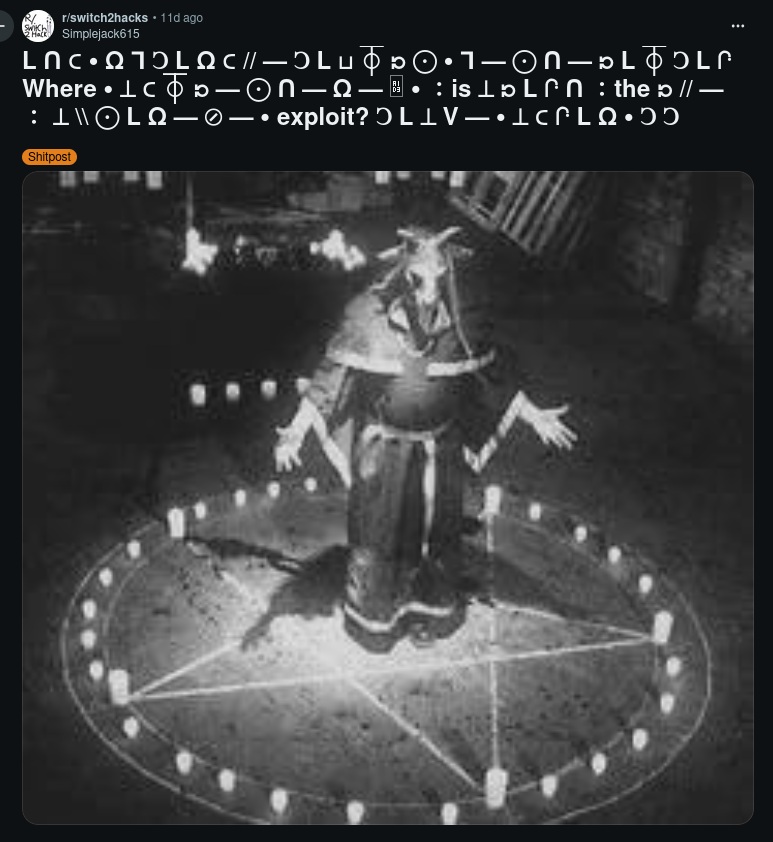

---

<!-- .slide: class="center" -->

# Gracias

¿Preguntas?

yo@akemp.es
